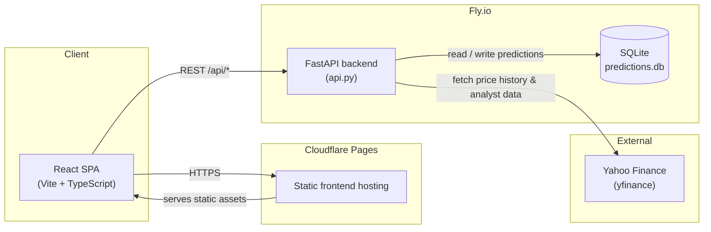

# System Architecture

- **Frontend**: React 19 + TypeScript, built with Vite, deployed to Cloudflare Pages.
- **Backend**: FastAPI, deployed to Fly.io (scales to zero when idle).
- **Persistence**: a single SQLite file on a Fly.io volume, tracking every prediction the app has
  ever made so accuracy can be measured after the fact (see [Track Record](track-record-sequence.md)).
- **Deploys**: both sides auto-deploy on push to `main` via GitHub Actions
  (`.github/workflows/deploy.yml`).
