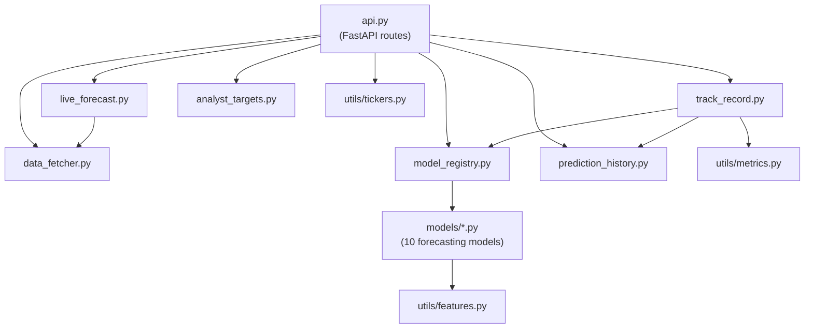

# Backend Module Dependencies

Each model in `models/` exposes a single `perform_*` function returning a prediction, its RMSE,
and its fitted values; `model_registry.py` is the single source of truth for the 10 models' keys,
names, formulas, and explanations, shared by every endpoint that needs them.
