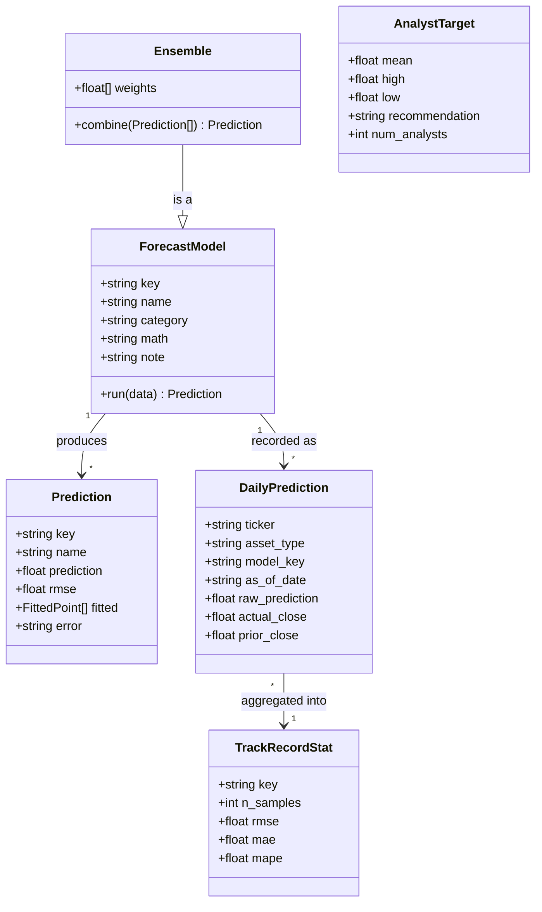

# Class Diagram

A conceptual model of CryptoCast's domain -- the backend is implemented functionally (plain
dicts and functions, not these classes literally), but this is the shape of the data as it flows
through the system.

- **ForecastModel** -- one of the 10 models (Linear Regression, ARIMA, ... SVR); `Ensemble` is a
  special case that combines every other model's `Prediction` by inverse-variance weighting.
- **Prediction** -- what a model returns for a single forecast request: the predicted price, its
  historical RMSE, and its fitted values for charting.
- **DailyPrediction** -- the persisted row (SQLite) behind every prediction, used for both
  bias-correction and Track Record scoring once `actual_close` resolves.
- **TrackRecordStat** -- the aggregate accuracy (RMSE / MAE / MAPE) computed from many
  `DailyPrediction` rows for a given model.
- **AnalystTarget** -- the external Yahoo Finance consensus price target shown for comparison on
  the Compare page.
