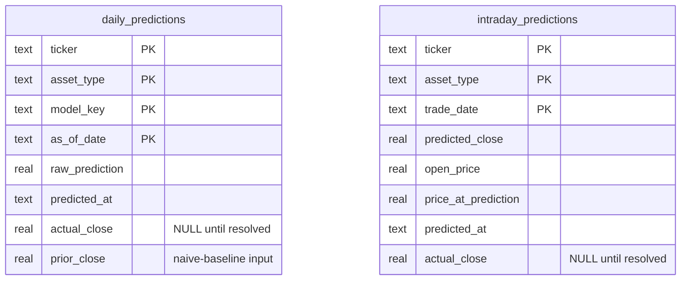

# Database Schema

Two SQLite tables, both append/upsert-only with no scheduled jobs -- every write happens as a
side effect of a real API request.

`daily_predictions` holds one row per (ticker, asset type, model, date) -- including a synthetic
`model_key = "ensemble"` row -- and backs both the rolling bias-correction shown live in the
Forecast pages and the [Track Record](track-record-sequence.md) statistics.

`intraday_predictions` is the same idea at intraday granularity for the Live page: one row per
(ticker, asset type, trade date), resolved once the trading day ends.
