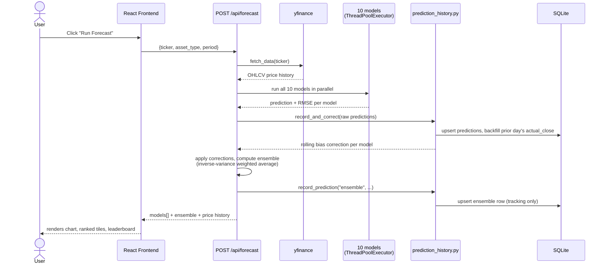

# Forecast Request Sequence

What happens when a user clicks "Run Forecast" on the Stock, Crypto, or Compare page.

The ensemble's own prediction is tracked separately from the 10 individual models specifically so
its accuracy can be measured later -- see [Track Record](track-record-sequence.md).
