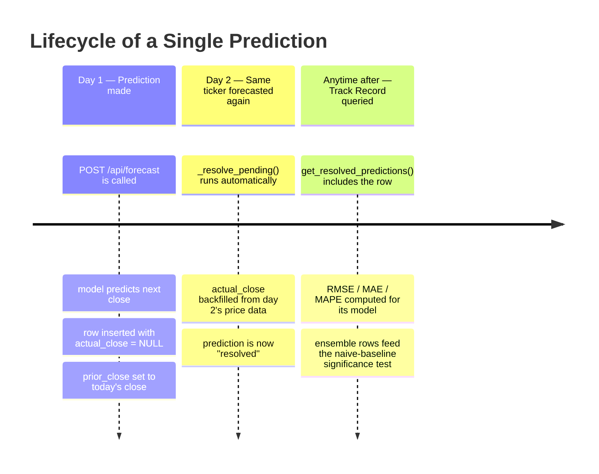

# Prediction Lifecycle Timeline

The life of a single prediction, from the moment it's made to the moment it counts toward Track
Record -- no scheduler involved, every step is a side effect of a real API request.

Nothing is scored until it resolves, and nothing is discarded -- a prediction sits as "pending"
for as long as it takes before that ticker is forecasted again, which is also what backfills its
`actual_close`.
