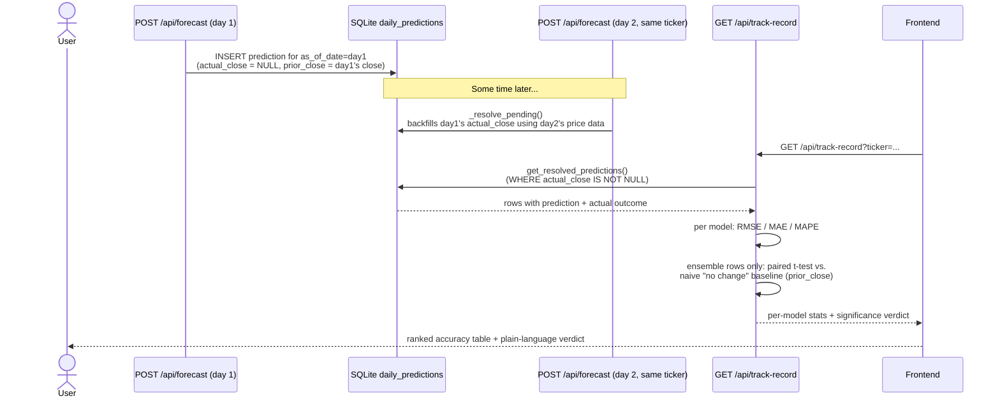

# Track Record: Prediction Resolution & Scoring

Every prediction is written the moment it's made, then resolved the next time that ticker is
forecasted on a later trading day -- no scheduler required.

The naive baseline for a given day is simply "the price won't move" -- the closing price at
prediction time. The paired t-test (`scipy.stats.ttest_1samp` on the per-day difference in
absolute error) answers a concrete question: does the ensemble's error actually differ from the
naive baseline's, with at least 20 resolved days before the test is considered meaningful.
