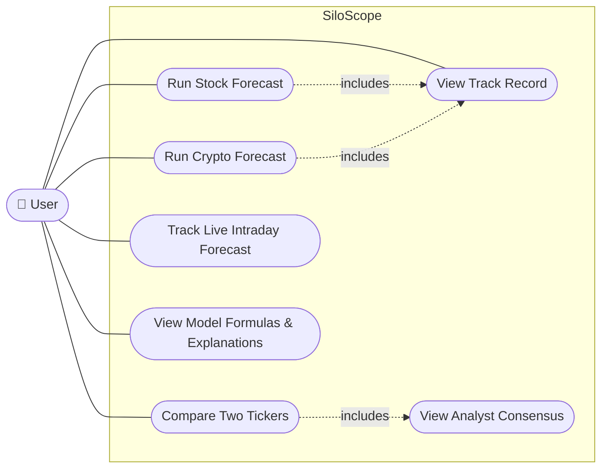

# Use Case Diagram

- **Run Stock / Crypto Forecast** -- pick a ticker, run all 10 models + the ensemble, see which
  has actually been most accurate for it. Each includes a per-ticker glimpse of Track Record.
- **Compare Two Tickers** -- run two forecasts side by side; includes Analyst Consensus (Yahoo
  Finance analyst targets) when available for that ticker.
- **Track Live Intraday Forecast** -- predicts today's close from the return so far.
- **View Model Formulas & Explanations** -- the home page's formula showcase for all 10 models.
- **View Track Record** -- rolling accuracy per model and the ensemble-vs-naive-baseline
  significance test, across the app's full prediction history.
